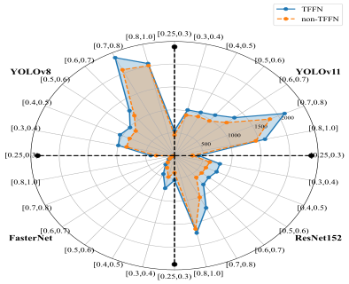
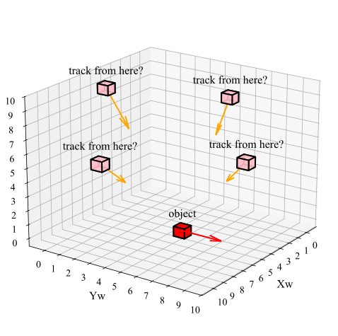
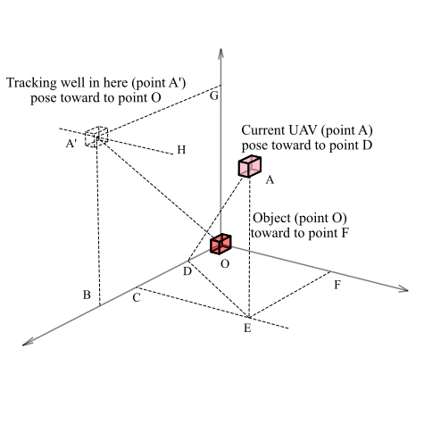
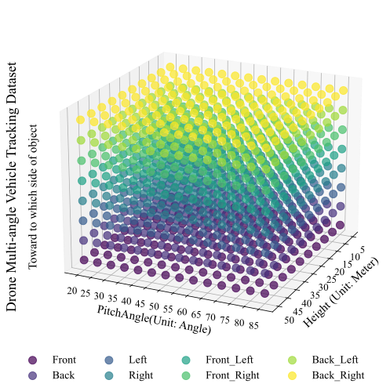

# MVR
We will continue to update the data and code corresponding to the paper on multi-path dynamic tracking strategy for MVR-assisted small object tracking!

Hardware environment for this technical experiment: 

>Intel (R) Xeon (R) Silver 4215R CPU @ 3.20 GHz. We tested the inference speed at FP32 precision on our hardware. Specifically, our complete hardware-related metrics are: NVIDIA GeForce RTX 3090 model, CUDA cores of 8.6, total video memory of 24GB, and matrix multiplication performance of 21.31~22.04 TFLOPS.

>The required environment is Python 3.8 (all packages in the code are installed based on Python 3.8).

***Follow Table: The achievements of our MVR (TFFN Module Assisted small object detecting)***
<table>
  <thead>
    <tr>
      <th>Network</th>
      <th>TFFN (✔:used)</th>
      <th>REC⬆</th>
      <th>PRE〰</th>
      <th>FPR〰</th>
      <th>FNR⬇</th>
      <th>F1-score⬆</th>
      <th>mAP@0.5:0.95⬆</th>
      <th>mAP@0.75⬆</th>
      <th>mAP@0.5⬆</th>
    </tr>
  </thead>
  <tbody>
    <tr>
      <td rowspan="2">Deformable DETR</td>
      <td></td>
      <td>9.79%</td>
      <td>86.61%</td>
      <td>1.47%</td>
      <td>90.21%</td>
      <td>17.59%</td>
      <td>24.30%</td>
      <td>26.12%</td>
      <td>41.69%</td>
    </tr>
    <tr>
      <td>✔</td>
      <td>20.65%⬆</td>
      <td>77.43%</td>
      <td>0.68%</td>
      <td>79.35%⬇</td>
      <td>32.60%⬆</td>
      <td>41.85%⬆</td>
      <td>42.89%⬆</td>
      <td>76.11%⬆</td>
    </tr>
    <tr>
      <td rowspan="2">FasterNet</td>
      <td></td>
      <td>7.96%</td>
      <td>51.93%</td>
      <td>1.61%</td>
      <td>92.04%</td>
      <td>13.80%</td>
      <td>15.30%</td>
      <td>12.63%</td>
      <td>32.31%</td>
    </tr>
    <tr>
      <td>✔</td>
      <td>13.26%⬆</td>
      <td>42.58%</td>
      <td>1.92%</td>
      <td>86.74%⬇</td>
      <td>20.23%⬆</td>
      <td>18.40%⬆</td>
      <td>14.60%⬆</td>
      <td>40.23%⬆</td>
    </tr>
    <tr>
      <td rowspan="2">FasterRCNN</td>
      <td></td>
      <td>24.42%</td>
      <td>84.64%</td>
      <td>1.66%</td>
      <td>75.58%</td>
      <td>37.90%</td>
      <td>51.38%</td>
      <td>60.82%</td>
      <td>76.42%</td>
    </tr>
    <tr>
      <td>✔</td>
      <td>31.80%⬆</td>
      <td>87.77%</td>
      <td>0.83%</td>
      <td>68.20%⬇</td>
      <td>46.69%⬆</td>
      <td>58.45%⬆</td>
      <td>68.26%⬆</td>
      <td>88.86%⬆</td>
    </tr>
    <tr>
      <td rowspan="2">MobileNetV3</td>
      <td></td>
      <td>23.31%</td>
      <td>85.22%</td>
      <td>1.99%</td>
      <td>76.69%</td>
      <td>36.60%</td>
      <td>47.73%</td>
      <td>55.72%</td>
      <td>73.45%</td>
    </tr>
    <tr>
      <td>✔</td>
      <td>31.02%⬆</td>
      <td>86.10%</td>
      <td>1.01%</td>
      <td>68.98%⬇</td>
      <td>45.61%⬆</td>
      <td>54.74%⬆</td>
      <td>62.36%⬆</td>
      <td>86.77%⬆</td>
    </tr>
    <tr>
      <td rowspan="2">MobileNetV4</td>
      <td></td>
      <td>6.97%</td>
      <td>57.74%</td>
      <td>1.17%</td>
      <td>93.03%</td>
      <td>12.44%</td>
      <td>17.90%</td>
      <td>15.04%</td>
      <td>37.30%</td>
    </tr>
    <tr>
      <td>✔</td>
      <td>10.59%⬆</td>
      <td>47.56%</td>
      <td>1.27%</td>
      <td>89.41%⬇</td>
      <td>17.32%⬆</td>
      <td>20.36%⬆</td>
      <td>15.99%⬆</td>
      <td>44.67%⬆</td>
    </tr>
    <tr>
      <td rowspan="2">ResNet152</td>
      <td></td>
      <td>18.47%</td>
      <td>88.81%</td>
      <td>1.59%</td>
      <td>81.53%</td>
      <td>30.59%</td>
      <td>46.10%</td>
      <td>53.55%</td>
      <td>71.35%</td>
    </tr>
    <tr>
      <td>✔</td>
      <td>27.92%⬆</td>
      <td>87.16%</td>
      <td>0.76%</td>
      <td>72.08%⬇</td>
      <td>42.29%⬆</td>
      <td>55.11%⬆</td>
      <td>62.66%⬆</td>
      <td>87.41%⬆</td>
    </tr>
    <tr>
      <td rowspan="2">YOLOv8</td>
      <td></td>
      <td>24.17%</td>
      <td>81.71%</td>
      <td>2.06%</td>
      <td>75.83%</td>
      <td>37.30%</td>
      <td>55.36%</td>
      <td>66.98%</td>
      <td>78.54%</td>
    </tr>
    <tr>
      <td>✔</td>
      <td>29.72%⬆</td>
      <td>88.71%</td>
      <td>0.95%</td>
      <td>70.28%⬇</td>
      <td>44.53%⬆</td>
      <td>61.55%⬆</td>
      <td>72.93%⬆</td>
      <td>89.85%⬆</td>
    </tr>
  </tbody>
</table>

**With the assistance of our PoseSet, the drone can selectively choose multiple optimal tracking poses, while avoiding target loss due to the model's poor detection perspective.**

***Follow Videos: The Results of our MVR (MPST Module Assisted small object Tracking)***

***Bad Pose (bad Tracking!!!):***

***PoseSet1 (good Tracking):***

***PoseSet2:***

***PoseSet3:***

***PoseSet4:***

